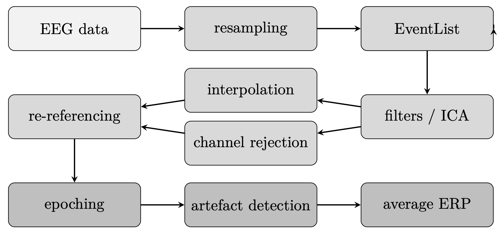
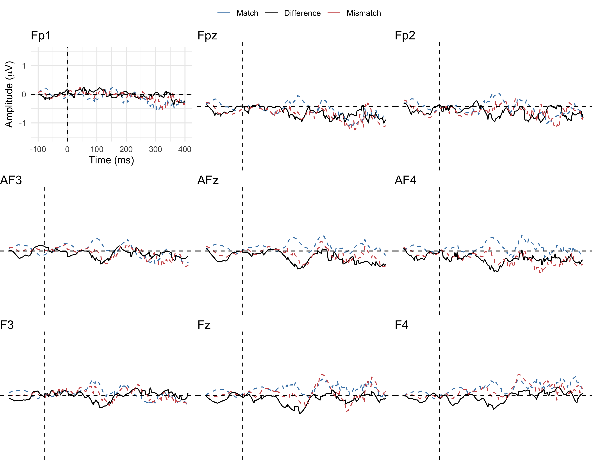
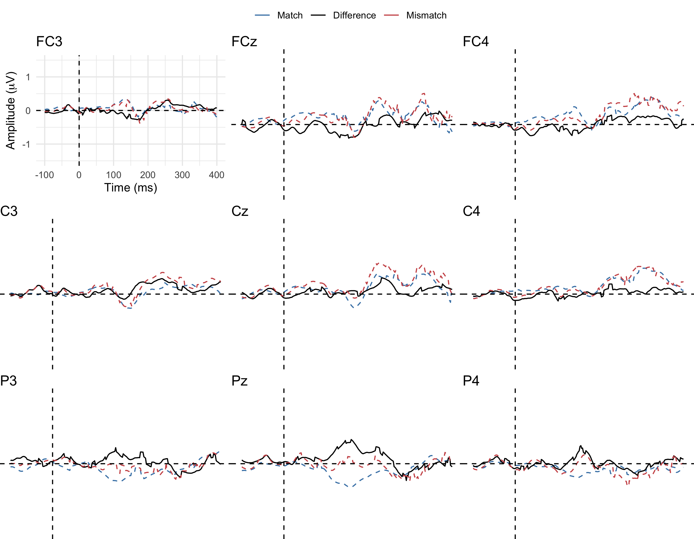
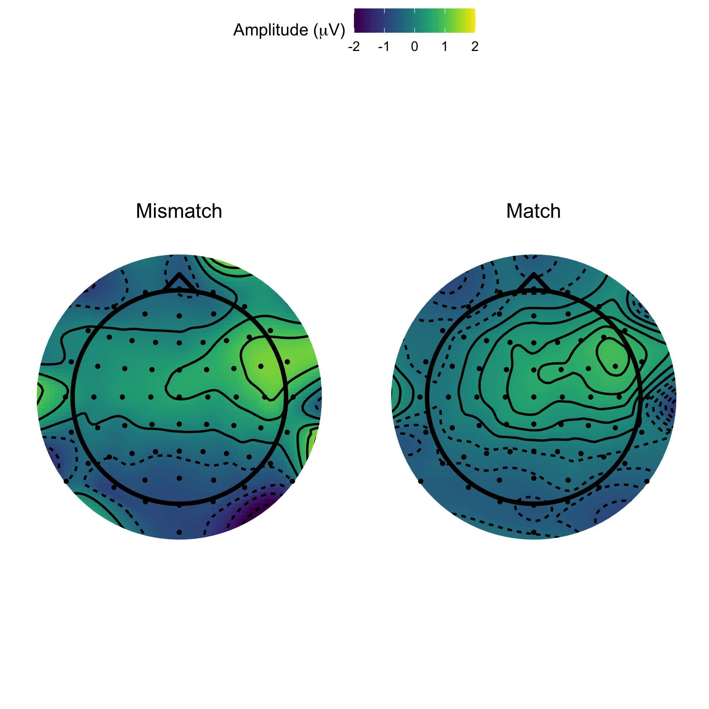
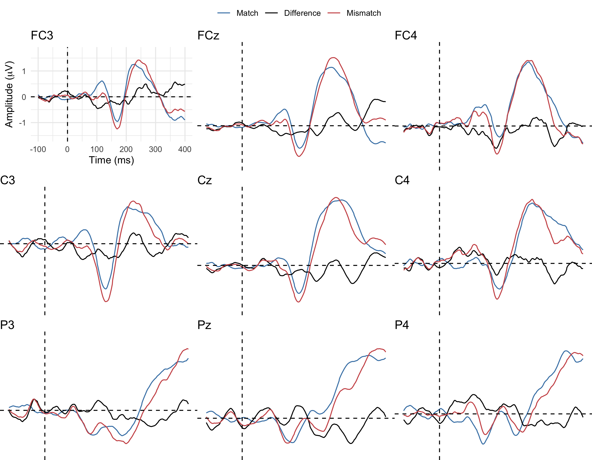
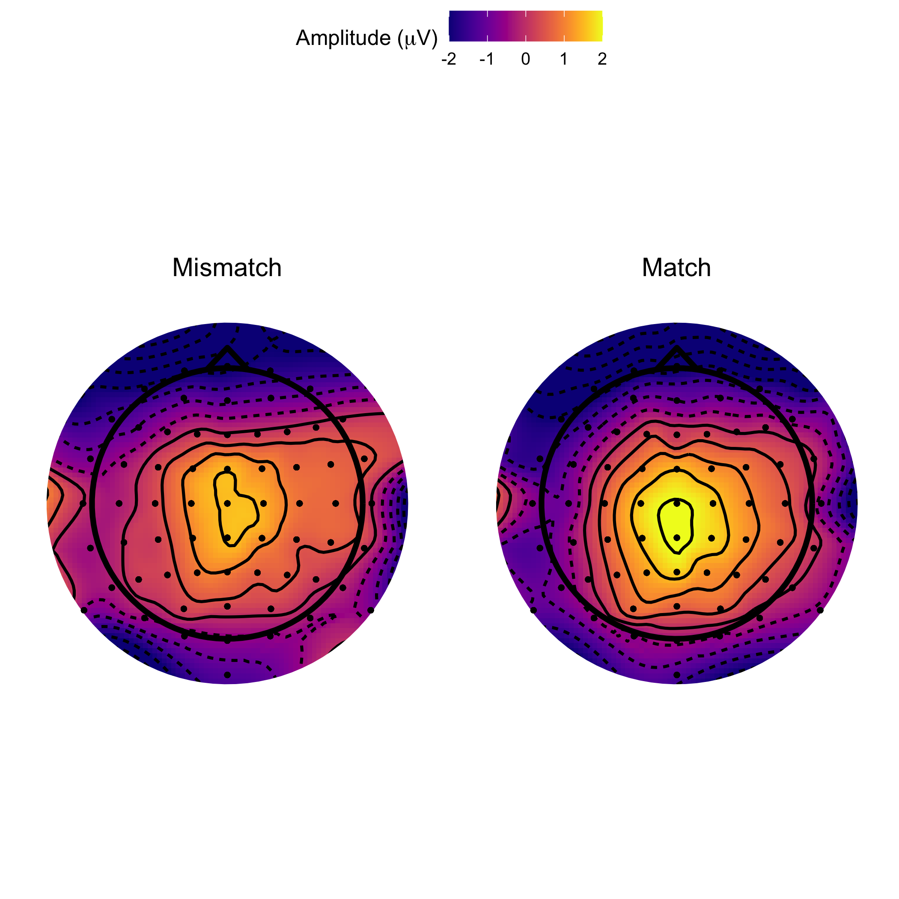

```{r setup, include = F}
knitr::opts_chunk$set(fig.align="center")
```

# Introduction

## Introduction

\begin{center}
Four years ago...
\end{center}

## Introduction

Can event-related potential data inform information flow order in speech perception? \pause i.e. what the extent of top-down mediation is during speech perception. 

## Event-related potentials

Event-related potentials (ERP) are measured brain responses that are direct result of a __sensory__, __cognitive__ or motor event (Luck 2005)

\pause

Event-related potential components are measured with electroencephalography (EEG) equipment.

## Introduction

Top-down vs bottom-up in speech perception: \pause

\small \begin{itemize}[<+->]
\item Interactive models of speech perception e.g. \textbf{TRACE} (McClelland \& Elman 1986)
\item Feed-forward / modular models of speech perception e.g. \textbf{Cohort} (Marslen-Wilson 1984)
\end{itemize}

## Introduction

\small \pause
\begin{itemize}[<+->]
\item Elman, J. L., \& McClelland, J. L. (1988). Cognitive penetration of the mechanisms of perception: Compensation for coarticulation of lexically restored phonemes. Journal of Memory and Language, 27(2), 143-165.
\item Pitt, M. A., \& McQueen, J. M. (1998). Is compensation for coarticulation mediated by the lexicon? Journal of Memory and Language, 39, 347–370.
\item Magnuson et al. (2003). Lexical effects on compensation for coarticulation: \textbf{The ghost of Christmash past}. Cognitive Science, 27(2), 285-298.
\item McQueen, J. M. (2003). \textbf{The ghost of Christmas future: didn’t scrooge learn to be good?}: Commentary on Magnuson et al. (2003). Cognitive Science, 27(5), 795-799.
\item McQueen, et al. (2009). No lexical–prelexical feedback during speech perception or: \textbf{Is it time to stop playing those Christmas tapes?}. Journal of Memory and Language, 61(1), 1-18.
\end{itemize} \normalsize

## Elman & McClelland (1988)

Compensation for coarticulation: (Mann \& Repp 1981) \pause

\begin{itemize}[<+->]
\item /t-k/ perceived more often as /k/ following /s/
\item /t-k/ perceived more often as /t/ following /\textesh/
\end{itemize}

Ganong effect (Ganong 1980)

\begin{itemize}[<+->]
\item Ambiguous phonemes are solved more often with the choice that makes a word vs. a non-word 
\item e.g. Christma/s-\textesh/ more often solved as Christma/s/. 
\item Effect stronger at phoneme boundary.
\end{itemize}

## Elman & McClelland (1988)

\begin{center}
\normalsize
Christma\textbf{/s-\textesh/} \textbf{/t-k/}capes  
  
    
\pause Cool, huh?
\end{center}

## Introduction

Can event-related potential data inform information flow order in speech perception? \pause i.e. what the extent of top-down mediation is during speech perception. 

## Event-related potentials

ERP (and EEG) offer unparalleled temporal resolution, \pause opening a direct window into cognitive processes of online language processing and speech perception. 

\pause

The original goal of my thesis was that to __design__ a handful of __ERP experiments to investigate lexical feedback__ and top-down processes of speech perception. \pause But how?

## Event-related potentials

\begin{itemize}[<+->]
\item Mismatch Negativity (\textbf{MMN})
\item Phonological Mapping\textbf{*} Negativity (\textbf{PMN})
\item \textbf{N400}
\item \textbf{P600}
\end{itemize}

\tiny

\textbf{*} Originanly named Phonological Mismatch Negativity 

\normalsize

## MMN

\small

The mismatch negativity (MMN) is a cross-sensorial ERP component often observed in frontocentral regions of the scalp between 150 and 250 ms post stimulus onset \pause

The mismatch negativity reflects the perception of a deviant stimulus in a sequence of standard stimuli (e.g. Garrido et al., 2009) \pause

In the auditory domain, a deviant stimulus can be identified by differences in pitch, duration, stress and frequency range (Erlbeck et al., 2014)

\normalsize

## MMN

However, the MMN was also found to be sensitive to phonological mapping (Pulvermuller 2001) \pause

\small
\begin{itemize}[<+->]
\item MMN to the presentation of mismatching Finnish words
\item No MMN in control group
\end{itemize} \normalsize

## N400

The N400 (Kutas \& Hillyard 1980) is part of the normal brain response to words and other meaningful stimuli.
\pause
\begin{center}
nurse \pause doctor \pause | \pause  
pizza \pause pineapple \pause  
\end{center}

* Other paradigms include cloze-probability mismatch (e.g. Connolly and Phillips 1994)

## Phonological Mapping Negativity

The Phonological Mapping (or Mismatch) Negativity, __PMN__ is an event-related potential component hypothesized to index phonological mismatch and mapping \pause (e.g. Connolly and Phillips 1994; Connolly et al. 2001) 

## Phonological Mapping Negativity

However, while some studies (e.g. Connolly and Phillips 1994) have linked the PMN to phonological mapping during the lexical selection stage of speech perception..

\pause 

Others (e.g. Newman et al.) report that the PMN is a __marker of acoustic and pre-lexical information__. 

## Connolly and Phillips (1994)

Event-Related Potential Components Reflect Phonological and Semantic Processing of the Terminal Word of Spoken Sentences: 

\pause

* The piano is out of \pause tune \pause (no mismatch) \pause
* The piano is out of \pause tuna \pause (N400) \pause
* The piano is out of \pause pizza \pause (N400 and PMN) \pause
* ...

## Newman et al. (2003)

Phoneme deletion task to study the PMN:

\pause

Delete /k/ from the word "clap" \pause

* lap \pause
* aap \pause
* dog 

## Phonological Mapping Negativity

Lewendon et. al (2020) suggest that the possibility exists that the PMN is an extension of either the Mismatch Negativity (MMN) or N400 components

## Phonological Mapping Negativity

Lewendon et. al (2020) also report that the majority of the literature on the PMN is characterized by contradictory findings and methodological limitations, e.g.

\small

\begin{itemize}[<+->]
\item Contrasting theories of the PMN
\item Mixed topographical locations: 
  \begin{itemize}[<+->]
  \item \footnotesize Some studies report discovering the PMN in frontal and central sites, others in parietal / mid-line / evenly spread across the scalp.
  \end{itemize}
\item \small Methodological limitations: 
  \begin{itemize}[<+->]
  \item \footnotesize Few participants (usually < 10)
  \item \footnotesize Few trials (usually < 40)
  \item \footnotesize Confounding variables
  \end{itemize}
\end{itemize}

\normalsize

## Research questions

\pause \small

\begin{itemize}[<+->]
\item \textbf{Is the PMN in response to acoustic, phonetic, phonological, lexical mapping and mismatch, none or a combination of all?}
\item \textbf{Is any other ERP component found in response to acoustic, phonetic and phonological mismatch in place of / together with the PMN?}
\end{itemize}

\normalsize

## Research questions

Why the PMN.. \pause _and why now?_

\small \pause

\begin{itemize}[<+->]
\item The PMN (placed in between phonetic and lexical processing) might play a key role in future investigations into architectures of grammar and speech perception 
\item Clinical studies have recently used the PMN as a \emph{marker of phonological processing abilities in patient populations} (Robson et al. 2017). However, it is not clear what processes the PMN really indexes. 
\end{itemize}

\normalsize

# Methods

## Experimental design

\pause Three neuro-imaging experiments designed to introduce new contexts in which to probe the elicitation of the PMN component.

\pause Experiments __1__, __2__ (and __3__) were designed to simultaneously work independently while also being fully comparable.

## Equipment & Processing

Hardware:

\small \pause

\begin{itemize}[<+->]
\item 64 active pin-type \textbf{BioSemi} electrodes for the scalp
\item 6 (EX1 to EX6) face electrodes
\item BioSemi hardware (e.g. receiver)
\end{itemize}

\normalsize

## Equipment & Processing

Software:

\small \pause

\begin{itemize}[<+->]
\item Praat (w/ Vocal Toolkit)
\item BioSemi Actiview
\item Neurobehavioral Systems' \textbf{Presentation}
\item MATLAB (2018b; 2019a; 2019b)
\item EEGLAB (Delorme \& Makeig 2004) 
\item ERPLAB (Lopez-Calderon \& Luck, 2014)
\item R (4.1) (R Core Team 2021)
\end{itemize}

\normalsize

## Equipment & Processing

EEG pre-processing: \pause
  
    
  
```{r, out.width = "80%", echo = F}

```

## Equipment & Processing

EEG pre-processing: \pause

\begin{itemize}[<+->]
\item Offline average reference
\item 512 Hz sampling frequency
\item 0.01 - 40 Hz band-pass filter
\item 50 Hz notch filter for AC hum
\end{itemize}

## Equipment & Processing

Statistical analyses:

\small \pause

\begin{itemize}[<+->]
\item Exploratory channel-level multivariate testing with package \texttt{ERP} (Causeur et al. 2020) and the Adaptive Factor Adjustment (AFA) procedure (Sheu et al. 2016)
\item Mean amplitude modelling with mixed-effect models \& package \texttt{lme4} (Bates et al. 2015)
\end{itemize}

\normalsize 

## Equipment

Data visualisation:

\pause \small

\begin{itemize}[<+->]
\item Grand-Average / difference ERP plots with \texttt{ggplot2} (Wickham 2016)
\item Cubic spline interpolation scalp maps with package \texttt{akima} (Akima and Gebhardt 2020)
\end{itemize}

\normalsize

## Reproducibility

{width="10%"}

\small \pause Slides for this talk are available on GitHub at the following repository: `mcanzi/2021_UNIKON` \pause  

\pause Data, code and model summaries are available on GitHub at the following repository `mcanzi/phd_codedata`

\pause My thesis has been submitted and will be available through open access following thesis defense (in August) and corrections.

\normalsize 

# Experiment 1

## Procedure

\small

\begin{itemize}[<+->]
\item Participants were trained to learn three pairs of tri-syllabic nonce words, presented auditorily, in a computerized training phase (e.g. \emph{pitabu dipida})
  \begin{itemize}[<+->]
  \item \footnotesize Transitional probabilities within the two items of each nonce-word pair was 1.0 
  \end{itemize}
\item \small Participants were tested on their knowledge of the experimental stimuli in a computerized task
\item During EEG data collection, stimuli were played to participants during a passive listening task, however..
  \begin{itemize}[<+->]
  \item \footnotesize In 33\% of total trials (400 total trials), the first syllable of the second nonce-word of each pair would be manipulated to break expectations
  \end{itemize}
\end{itemize}

## Procedure

\small

\begin{center}

Before training, EEG data was recorded with subjects listening passively to the presentation of matching and mismatching nonce-word pairs. This was done in order to estabilish a baseline. 

\end{center}

\normalsize

## Stimuli 

\begin{center}

pitabu \pause dipida \pause

pitabu \pause \textbf{ba}pida \pause

pitabu \pause \textbf{bu}pida \pause

\end{center}
\small

## Stimuli

\begin{itemize}[<+->]
\item Stimuli were synthesized using Mac OS Text-to-Speech
\item Stimuli concept from Astheimer and Sanders (2011), who controlled for transitional probabilities, resemblance to real words, etc.
\item Vowel, syllable and word length were controlled (each syllable was 200 ms long)
\item Speaker and pitch contours were the same for all stimuli.
\end{itemize}

## Participants

22 Participants (F = 13) took part to the experiment. \pause

\begin{itemize}[<+->]
\item 22 right-handed adults
\item 22 BrE speakers
\item Age (M = 20, 18-25)
\item Normal or corrected to normal vision and hearing
\item No reported use of psychoactive medications
\end{itemize}

## Results: __Baseline__

\begin{center} 

\pause

No effects of interest were found \pause

\end{center} \small

\begin{itemize}[<+->]
\item Few trials
\item Low SNR
\end{itemize}

## Results

```{r, out.width = "60%", echo = F}

```

## Results

\pause

```{r, out.width = "60%", echo = F}

```

## Results: __PMN__

\footnotesize 
\begin{center}

Cubic-spline interpolation scalp maps. Mean amplitude betweeen 280 and 320 ms post-stimulus onset.

\end{center} 
\pause \normalsize

```{r, out.width = "45%", echo = F}

```

## Results: __PMN__

\pause \small

We fitted a LMEM to mean amplitude measured between 280 and 320 ms PSO. \pause \texttt{Condition}, \texttt{Region} and \texttt{Hemisphere} were fitted as main effects as well as three-way interaction. \pause Varying intercepts allowed for \texttt{Subject}

\begin{itemize}[<+->]
\item No main effect of \texttt{Condition} [F(\textsubscript{1,1797}) = 0.01, p = .89)]
\item No interaction of \texttt{Condition} \& \texttt{Region} [F(\textsubscript{10,1797}) = 1.39, p = .17)]
\end{itemize} \normalsize

## Results: __Other effects__

\begin{itemize}[<+->]
\item Small negative effect between 150-200 ms for mismatch condition (frontocentral\*) (\textbf{MMN?})
\item Bigger positive effect between 500-700 ms for mismatch condition (centroparietal\*) (\textbf{P600?})
\item \tiny \* In case of a significant interaction between \texttt{Condition} and \texttt{Region}, pairwise contrasts were carried out with package \texttt{emmeans} (Lenth et al. 2018)
\end{itemize} \normalsize

## Discussion 

\begin{center}

No instance of \textbf{PMN} (in any of its expected forms) was found

\end{center}

## Discussion

Possible explanations: \pause

\small
\begin{itemize}[<+->]
\item PMN is more "higher-level" than previously theorized
\item Methodological limitations of Exp. 1
  \begin{itemize}[<+->]
  \item \footnotesize Passive listening
  \item \footnotesize Possible P3a contamination?
  \end{itemize}
\end{itemize} \normalsize

# Experiment 2

## Methods

\small \pause
\begin{itemize}[<+->]
\item Designed to be (fairly) comparable to experiment one
  \begin{itemize}
  \item \footnotesize Same stimuli as Exp 1
  \item \footnotesize No lexical activation
  \end{itemize}
\item \small Includes active, behavioural tasks
\item More streamlined
\end{itemize} \normalsize

## Stimuli

\begin{center}

Same nonce words as \textbf{Experiment 1}

\end{center}

## Procedure

\begin{center}

di + \pause (500 ms pause) + \pause pi + \pause (500 ms pause) + \pause da \pause  

(4 s pause) \pause  
  
dipida  
\end{center}

## Procedure

However, in 33% of total trials

\begin{center}

di \pause pi \pause da \pause  
  
\textbf{ba}pida
\end{center}

## Participants 

20 participants (F = 12) took part to the experiment: \pause

\begin{itemize}[<+->]
\item 20 right-handed adults
\item 20 BrE speakers
\item Age (M = 19, 18-24)
\item Normal or corrected to normal vision and hearing
\item No reported use of psychoactive medications
\item 0 took part to both Exp 1 and Exp 2
\end{itemize}

## Results

\pause

```{r, out.width = "60%", echo = F}

```

## Results: __PMN__

Cubic-spline interpolation scalp maps. Mean amplitude between 280 and 320 ms post-stimulus onset.

```{r, out.width = "45%", echo = F}

```

## Results: __PMN__

\pause \small

We fitted a LMEM to mean amplitude measured between 280 and 320 ms PSO. \pause \texttt{Condition}, \texttt{Region} and \texttt{Hemisphere} were fitted as main effects as well as three-way interaction. \pause Varying intercepts allowed for \texttt{Subject}

\begin{itemize}[<+->]
\item No main effect of \texttt{Condition} [F(\textsubscript{1,1965.6}) = 0.0001, p = .98)]
\item Significant interaction of \texttt{Condition} \& \texttt{Region} [F(\textsubscript{10,1948.2}) = 0.8, p = .001)]. However..
\item Only significant main effect on Condition between match (M = 0.51 $\mu$V) and mismatch (M = -0.04 $\mu$V) at parieto-occipital scalp sites.
\end{itemize} \normalsize

## Results: __Other effects__

\begin{itemize}[<+->]
\item Small negative effect between 75-125 ms for mismatch condition (frontal) (\textbf{N1?})
\item Small negative effect between 150-200 ms for mismatch condition (left hemisphere) (\textbf{MMN? ELAN?})
\item Bigger positive effect between 500-700 ms for mismatch condition (centroparietal) (\textbf{P600?})
\end{itemize}

## Discussion 

No instance of \textbf{PMN} (in any of its expected forms) was found

## Discussion

Possible explanations: \pause

\begin{itemize}[<+->]
\item PMN is more "higher-level" than previously theorized
\item \sout{Methodological limitations of Exp. 1}
\end{itemize} 

# General Discussion

## PMN?

Contrasting findings in PMN literature cause: 

\small \begin{itemize}[<+->]
\item Difficulty in determining whether an observed response matches the PMN (in function and topographical distribution)
\item Easy to mistake any component in a similar range as the PMN
\item Bulk of the (very limited) literature on the PMN attributed to one research group
\end{itemize}

## PMN?

The PMN appears to be linked to lexical processing more than to the processing of pre-lexical information (including acoustic and phonetic information). \pause

\begin{itemize}[<+->]
\item This supports earlier theories of the PMN (e.g. Connolly \& Phillips 1994)
\item Goes against later interpretations (e.g. Newman et al. 2003)
\item How much of the PMN is in response to phonological information specifically? 
  \begin{itemize}[<+->]
  \item Issues with uses of PMN in clinical settings
  \end{itemize}
\end{itemize}

## Other findings

Earlier responses (150-200 ms) and later P600-like effects reinforce: \pause

\begin{itemize}[<+->]
\item Mismatch stimuli were recognised as such
\item Early, acoustic / phonetic mismatch
\item P600 as an index of sequence violation
\end{itemize}

Could the PMN be a later instance of the MMN?

## Future directions

\pause

\begin{itemize}[<+->]
\item Explore other responses to stimulus presentation in Exp 1 and 2
\item Determine whether they are to acoustic, phonetic, phonological features of stimuli..
  \begin{itemize}[<+->]
  \item \footnotesize Done in Exp 3. Data collection interrupted by COVID-19
  \end{itemize}
\item \small Try different paradigms that isolate phonological and lexical processing
\end{itemize}

## Methodological limitations

If we consider the non-observation of the PMN as a cause of methodological limitations: \pause

\begin{itemize}[<+->]
\item PMN most likely not reliable enough as a marker for clinical experiments
\item Not a good candidate for experiments investigating information flow order in speech perception
\end{itemize}

## PMN: __All the right places__

\pause

\begin{center}

Replication

\end{center}

## Thank you!

\begin{center}

\small Special thanks to my supervisors \textbf{Dr Wendell Kimper} and \textbf{Dr Patrycja Strycharczuk}

\end{center}

```{r, echo = F, out.width = "45%"}

```

```{r, echo = F, out.width = "20%"}
knitr::include_graphics("img/manchester.png")
```